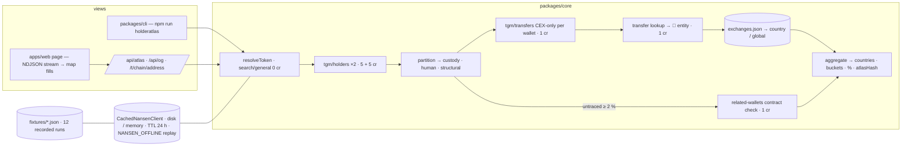

# Architecture — as shipped

One atlas function, three views (CLI, web page, JSON/OG routes). No database, no accounts, no LLM, no fonts from a CDN.



## Layout
```
packages/core/src
  client.ts      NansenClient: apikey header, 5 rps bucket, 8 s timeout, 1 retry on 429/5xx/timeout, sha256 per response, credit table,
                 subscribe(): start/end call events (the end carries the recorded Call itself — the rail and the drawer share one object)
  cache.ts       CachedNansenClient: read-through disk/memory cache, TTL, NANSEN_OFFLINE, timeout markers for deterministic replay
  nansen.ts      zod-validated bodies/responses for the five endpoints; chains; the 1-year window
  labels.ts      entityKey() normaliser, exchanges.json lookup, structural-tag rule
  exchanges.json 133 exchange entities → country (ISO) or global, one source each
  atlas.ts       the engine: resolve → holders → partition → probes → 4-wide lookup pool → contract check → aggregate → hash
  fixtures.ts    recorded-run format, read/write, fixtureStore()
packages/cli/src/cli.ts   the reproduce path: bars, the number, --explain call table, --json
apps/web
  app/page.tsx · components/Atlas.tsx     the ONE flow: input → stream → the picture → Save PNG / Copy link / calls drawer
  components/Rail.tsx · lib/rail.ts       the Nansen call rail: every call as it happens (pending → live/cached/error), counters, session log
  components/Poster.tsx                   the picture: one SVG (1600×900), literal colours, exported to PNG and reused by /api/og
  lib/world.ts                            Natural Earth 110m outlines (public domain), equirectangular, 167 centroids
  app/api/atlas/route.ts                  JSON or NDJSON stream; spend guard; fixture replay past the daily ceiling
  app/api/og/route.tsx                    link-preview card — fixture or today's cache only, never a live spend
  app/t/[chain]/[address]/page.tsx        permalink (streams on load; OG = the poster)
  app/judge/page.tsx                      for the judge — static, no key
  lib/guard.ts                            4 maps / IP / min · 3,000 live credits / day / instance · labelled degrade
scripts   spike.ts · seed.ts · verify.ts · bench.ts · fixture-set.ts · check_submission_readiness.ts
fixtures  12 recorded atlases (every raw response byte-for-byte, the clock, the atlas, the hash)
docs      SCORING.md · BENCH.md · DX-REPORT.md · screenshots/
```

## Data flow of one map (PEPE, defaults)
1. `search/general {search_query: "PEPE", result_type: "token", limit: 25}` → 3 candidates on supported chains → ethereum by market cap.
2. `tgm/holders` ×2 (all + exchange) in parallel → 100 rows → 57 custody · 41 human · 2 structural → examine 12 + 40.
3. Two window probes on the largest wallet (1 year → 30 days → skip) — deterministic, replayed by fixtures.
4. 52 wallets through a 4-wide pool under the 5 rps bucket: `tgm/transfers` (to, then from) → `transaction-with-token-transfer-lookup` → `entityKey` → `exchanges.json`. Every row streams as it lands (`{type: "wallet"}`), with the running aggregate.
5. Untraced humans ≥ 2 % → `profiler/address/related-wallets`; "Deployed by" → structural (`{type: "reclass"}`).
6. `aggregate()` → countries, global, other-entity, untraced, unnamed, error; `attributable`; `atlasHash`.
7. The page: the poster re-renders on every event (map bubbles, bar order, the number); the drawer lists every call.
   Every Nansen call also arrives as `{type: "call", phase: "start" | "end"}` the moment it starts and finishes — the rail on the right
   shows it pending, then live (green) / cached (grey) / error (red) with credits, ms and the response hash. The `end` event carries the
   same `Call` object the drawer prints, so the rail's counters and the drawer's totals cannot disagree.

## Determinism and honesty
- `atlasHash` covers token + per-row (kind, exchange, country, bucket, share) + the number. Latency, credits, label text: display only.
- Rows are sorted by supply before hashing, so a 4-wide pool and a sequential run hash identically (tested).
- A live timeout is written into the cache as a marker and replayed as a timeout offline — `npm run verify` reproduces USDC's error rows.
- Cached calls are recorded at 0 credits and labelled; failed calls are recorded at 0 credits with the error; nothing is hidden from the drawer.

## Spend model
~118 credits per cold map (10 holders + 1 probe + 12 × 2 custody + 40 × 2–3 humans + ≤ 5 contract checks); 0 warm (TTL 24 h; `/tmp` per Vercel instance). The public route is capped per IP and per day; past the ceiling a recorded fixture replays with a visible notice.

## Residual risks
| Risk | Mitigation |
|---|---|
| Nansen latency (1.7–2 s per call) makes a cold map 40–60 s | stream; 4-wide pool; the recording runs warm with the timestamp visible |
| Supply-weighted number dominated by one whale (LINK) | wallet-weighted share printed beside it; contract check removes deployed contracts |
| Label drift ("Upbit : Link Wallet") | normaliser + alias table; every spelling seen live pinned in tests; unknown 🏦 → visible "ENTITY" bar |
| Solana | honest unsupported state, never a crash |
| Per-instance guard counters on Vercel | a ceiling, not accounting; DAILY_CREDITS × instances ≪ balance |
