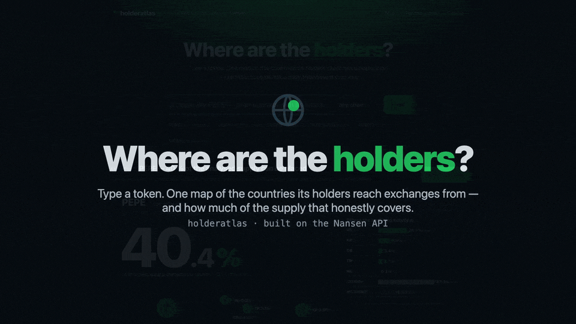
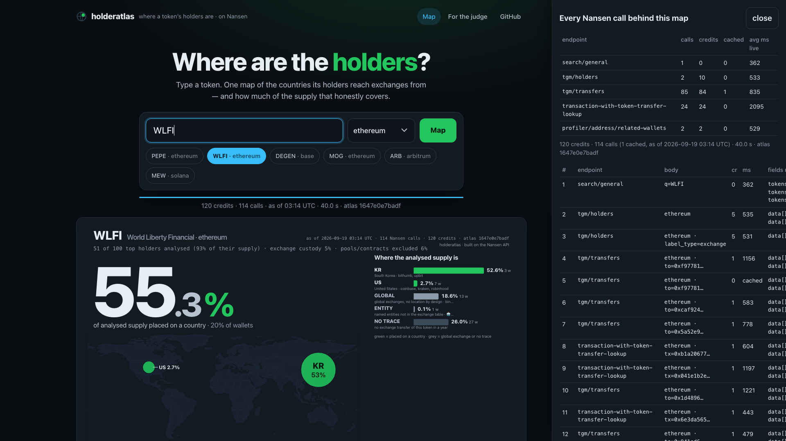
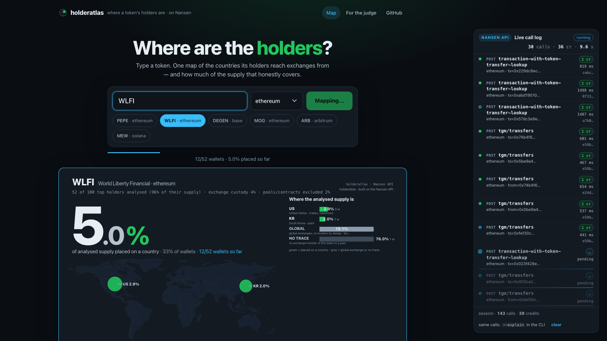
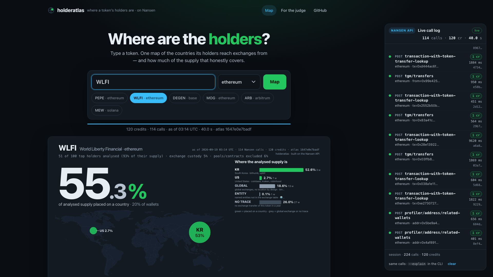
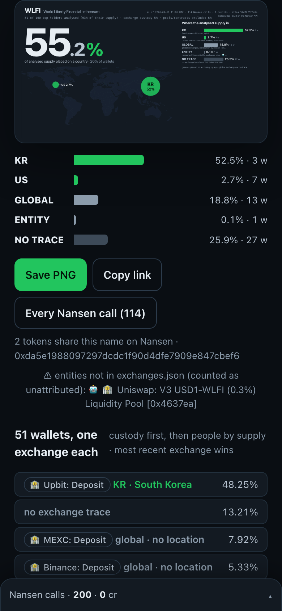
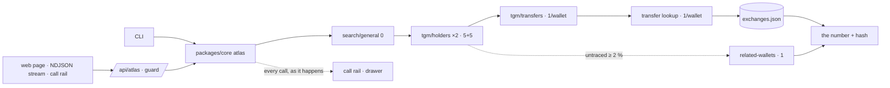

<div align="center">


<h1>Holder Atlas 🌍</h1>
<p><em>Type a token. See where its holders actually are.</em></p>



<p>One world map of the countries a token's holders reach exchanges from — read from Nansen's exchange entity labels, joined to a curated exchange→country table shipped in this repo — with the number that keeps it honest printed as large as the map: <b>the share of analysed supply the map can actually place</b>. Global exchanges are never placed. Grey is never hidden.</p>

<br/>

[](https://holderatlas.edycu.dev)
[](https://holderatlas.edycu.dev/judge)
[](https://nansen.ai/campaigns/meridian-buildathon)

<br/>


[](LICENSE)
[](https://github.com/edycutjong/holderatlas/actions/workflows/ci.yml)
[](https://github.com/edycutjong/holderatlas/security/code-scanning)
[](https://github.com/edycutjong/holderatlas/releases/latest)

</div>

---

## 📸 See it in Action



| Token in | Wallets stream in, each gains its exchange | The picture |
|---|---|---|
| `PEPE` · ethereum | 100 holders → 12 exchange-custody + 40 people examined; 🏦 Coinbase, 🏦 Upbit, 🏦 Binance… land one by one | **40.4 %** placed: US 24 · KR 10 · GB 3 · TR 3 · NL 0.3 — and **47 % on global exchanges, grey** (live, 2026-09-18) |
| `WLFI` · ethereum | Upbit's internal wallet holds half the analysed supply | **55.2 %** placed: KR 52 · US 3 |
| `DEGEN` · base | Coinbase custody + Coinbase withdrawals | **58.1 %** placed: US 54 · GB 2 · NL 1 |
| `MEW` · solana | exchanges visible but Nansen cannot name them on Solana | **0 %** — a hatched "unnamed 90 %" bar and a banner that says which field is missing |

Every map ships with a **live call rail** on the right — each Nansen call appears as it is made (endpoint · credits · ms · response hash), turning from pending to green — and a **provenance drawer**: every Nansen call, its body, credits, latency, cached or live, the fields used, and the atlas hash. The CLI prints the same with `--explain`. **Save PNG** renders the poster (1600×900) in the browser; the permalink `/t/<chain>/<address>` re-renders it and serves it as the link preview.

<div align="center"></div>

| Streaming — `WLFI` mid-run: the map filling, the call rail live on the right | The contrast — `WLFI` done: Upbit → KR 53 % | Mobile — the bar first, then the map; the rail docks at the bottom |
|---|---|---|
|  |  |  |

## 💡 The Problem & Solution

### The Problem

A token founder with a $20K community budget is asked "so where are our holders — Korea or the US?" and has nothing but 40-character strings. There is no KYC. Explorers tag a handful of exchanges and never tell Upbit from Binance 14 from an Indodax deposit wallet. Exchanges know where holders live; nobody turns that into a picture.

### The Solution

**Holder Atlas** reads the one place holders touch a jurisdiction — the exchange on their transfer — through Nansen's entity labels, and draws ONE picture: a world map with a bubble per country, a ranked bar, and the honesty number.

```
population   = tgm/holders (top 100) − pools/contracts/burn         # partition: exchange custody · people · structural
per wallet   = tgm/transfers (CEX-only, newest, 1 cr) → transaction-with-token-transfer-lookup (1 cr) → "🏦 Upbit: Deposit"
country      = exchanges.json[entity]                                 # Upbit → KR · Coinbase → US · Binance → global (never placed)
attributable = Σ supply placed on a country / analysed supply         ← printed as large as the map; by-wallet share beside it
atlasHash    = sha256(token + every row's attribution + the number)   # a replay and a live run that agree hash identically
```

Rules with live numbers in [docs/SCORING.md](docs/SCORING.md). The table is data, one source per row: [packages/core/src/exchanges.json](packages/core/src/exchanges.json) (133 exchanges).

## 🏗️ Architecture & Tech Stack

One atlas function, three views. No database, no accounts, no LLM, no fonts from a CDN.

<p align="center"></p>

<details><summary><b>Mermaid source</b> — expand to see the diagram as text (renders on GitHub)</summary>



</details>

| Layer | Choice | Why |
|---|---|---|
| Engine | TypeScript, `packages/core` — `atlas()`, zod-validated Nansen bodies, sha256 per response | one function for CLI, web, seed/verify/bench |
| Client | fetch, 5 rps bucket, 8 s timeout, 1 retry on 429/5xx, read-through cache (TTL 24 h), `NANSEN_OFFLINE` replay | a hung call never hangs the picture; warm map = 0 credits |
| Picture | one inline SVG (1600×900): hero number, Natural Earth outlines, bubbles, ranked bar; literal colours | exported to PNG on a canvas; reused by `/api/og` |
| Web | Next.js 15, React 19, plain CSS | the page streams the same events the CLI prints |
| Deploy | Vercel (`vercel.json` builds `apps/web`), key as a sensitive env, deployment protection off | one env var, nothing else |

More in [ARCHITECTURE.md](ARCHITECTURE.md).

## 🏆 Nansen Integration

The engine, not decoration — every placement on the map is a Nansen response field joined to one row of the table.

| Endpoint | Credits | Fields used | Decides |
|---|---|---|---|
| `search/general` (`result_type: token`) | 0 | `tokens[].symbol/chain/address/market_cap/rank` | which contract to map |
| `tgm/holders` (page 1, 100 rows) | 5 | `address`, `address_label`, `token_amount` | the population; pools/contracts out |
| `tgm/holders` (`label_type: exchange`) | 5 | `address`, `token_amount` | which holders are exchange custody |
| `tgm/transfers` (`include_cex`, `!include_dex`, `!non_exchange_transfers`, `to_address`/`from_address`, 1 year, 5 rows) | 1 × wallet | `transaction_hash`, `block_timestamp` | the wallet's newest exchange touch — or "no trace" |
| `transaction-with-token-transfer-lookup` | 1 × traced wallet | `token_transfer_array[].from/to_address_label` | **the exchange entity** → country / global |
| `profiler/address/related-wallets` | 1 × ≤ 5 | `relation` (`Deployed by`) | an unlabelled mega-holder is a contract → excluded |

~118 credits per cold map, 0 on a cache hit. Cached calls are labelled and never counted; failed calls are shown as "lookup failed", never guessed. **Every call is visible while it happens:** the page's right-hand rail streams each Nansen request as a row — pending → live (green) · cached (grey) · error (red) — with `POST endpoint`, the chain and wallet filter, the credits, the latency and the response sha256, and its counters equal the provenance drawer's totals exactly (same `Call` objects, nothing synthetic).

### Why only Nansen

An RPC shows transfers between hex strings; the map needs *who the counterparty is*. `transaction-with-token-transfer-lookup` is the only ≤ 5-credit field on any API that says "🏦 Upbit: Deposit" rather than "0x3f9a…". Take Nansen out and you would need a multi-chain transfer indexer, a balance snapshot service and an exchange-entity label database nobody publishes — and the third one does not exist outside Nansen. There is deliberately no fallback to IP geolocation or ENS parsing.

**Not used, on purpose:** `profiler/address/labels` (100 cr), `premium_labels` (150 cr), `agent/fast` (200 cr). What we learned the hard way — nine frictions, five wishes — is in [docs/DX-REPORT.md](docs/DX-REPORT.md).

## 📊 Engineering Rigor

| Metric | Value | Source |
|---|---|---|
| Tests | **181 tests** (`npm test`) — every label string seen live pinned to its key; the timeout path; offline replay = same hash | `packages/core/test/` |
| Property-based verification | **24,000 generated cases** (fast-check) = **14,000 property cases** — shares partition the supply, global never attributed, structural never in the denominator, hash purity, label normaliser, every table key resolves (7 × 2,000) — + **10,000 generated malformed queries** → 400 with zero fetches | `property.test.ts`, `boundary.test.ts` |
| Permission boundary | the server key never reaches a client (atlas, events, provenance, cache keys, errors) | `boundary.test.ts`, [SECURITY.md](.github/SECURITY.md) |
| Spend guard | only the page's own fetch (run marker) may go live — a bare GET of `/api/atlas` (crawlers, unfurlers, `curl`) gets the labelled fixture replay or a 202, never a Nansen call · 4 cold maps / IP / min · 3,000 live credits / day; past the ceiling a recorded fixture replays at 0 credits, labelled, or an honest 503 | `apps/web/lib/guard.ts`, `guard.test.ts` |
| Fixtures | 12/12 atlases reproduced offline, zero network, zero credits — including a recorded timeout replayed as a timeout | `npm run verify`, `fixtures/*.json` |
| Cold latency | p50 **40.3 s** · p95 **59.0 s** (4 tokens, live, 4-wide pool under 5 rps) | [docs/BENCH.md](docs/BENCH.md) |
| Warm latency | p50 **7 ms** | [docs/BENCH.md](docs/BENCH.md) |
| Credits per map | mean **118**, max 121 | [docs/BENCH.md](docs/BENCH.md) |
| Clean clone → first map | **54 s** (clone 1 · install 5 · first live map 34 · verify 1 · build 10 · tests 3) | see Getting Started |

### Honesty

- **Fixtures are replays, the default path is live.** `fixtures/*.json` hold 12 real runs recorded 2026-09-18 with every raw Nansen response byte-for-byte. `npm run verify` replays them with `NANSEN_OFFLINE=1` and requires the same atlas hash, the same countries and zero network calls. The CLI never reads them; the web app reads one only after the day's live credit ceiling is spent, and says so on the page.
- **Numbers come from scripts.** [docs/BENCH.md](docs/BENCH.md) is the output of `npm run bench`; [DEMO.md](DEMO.md) is pasted CLI output. The day-one spike (6 tokens) gave a median of 40.6 % placed on the five EVM tokens — the number this entry had to show before any UI was written.
- **Grey is never hidden.** Global-exchange custody, wallets with no exchange trace, entities outside the table, unnamed Solana exchanges and failed lookups are bars of the same chart, in the same scale, with wallet counts.

### Honest limits (6)

1. **Solana cannot be named.** The transfer lookup has no Solana support; Solana tokens show their custody share with every exchange "unnamed" and 0 % placed.
2. **Supply-weighted means whales decide.** 86 % of LINK's analysed supply is one 2017 team wallet with no exchange trace → 4 % placed; the by-wallet share (44 %) is printed beside the number for exactly this reason.
3. **Countries are exchange jurisdictions, not people.** Coinbase → US, Kraken → US, Revolut → GB by licence/HQ; every table row says why. Global exchanges are grey on purpose.
4. **Most recent exchange wins** — one lookup per wallet; a wallet that used Upbit last year and Binance last week is Binance.
5. **USDC-class tokens time out** on Nansen's per-wallet transfer filter; the engine probes, shrinks the window to 30 days, and skips the rest with a named reason rather than guessing.
6. **Top-100 holders, up to 52 examined** (12 custody + 40 people; a "person" the contract check turns out to be a contract leaves the number) — a sample weighted to whales and custody, not the retail tail; the caption says how many wallets are in the number and how much of the top-100 supply that is.

## 🚀 Getting Started

### Prerequisites

- Node 22 (20+ works)
- A Nansen API key from [app.nansen.ai/api](https://app.nansen.ai/api) — the only configuration

### Installation

```bash
git clone https://github.com/edycutjong/holderatlas && cd holderatlas
npm install
export NANSEN_API_KEY=nsn_...                              # one env var, nothing else
npm run holderatlas -- PEPE --chain ethereum               # ~120 credits, 40–60 s cold; 0 credits and 0 s the second time
```

### Run it in under 10 minutes

```bash
npm run holderatlas -- PEPE --chain ethereum --explain     # every wallet, every call, the number, the hash
npm run holderatlas -- WLFI --chain ethereum --json        # machine output
npm run verify                                             # replays 12 recorded atlases offline — no key, no network, 12/12
npm run dev                                                # http://localhost:3000 — the picture
```

Measured on a clean clone from GitHub (macOS, Node 22, warm npm cache, 2026-09-18 11:11 UTC): clone 1 s · install 5 s · first live map (WLFI, 120 credits) 34 s · `verify` 1 s · `next build` 10 s · tests 3 s — **54 s of machine time** plus pasting the API key.

## 🧪 Testing & CI

**6-stage pipeline:** Quality (Prettier · ESLint · tsc · vitest + coverage · offline replay · readiness) → Security (TruffleHog, npm audit; CodeQL via GitHub default setup, gitleaks in its own workflow) → Build → E2E smoke of every route without a key → Deploy gate → **Production deploy** (main only: `vercel pull` → `vercel build --prod` → `vercel deploy --prebuilt --prod`, then the stable alias is re-pointed). No API key anywhere in CI; the only secret is `VERCEL_TOKEN`. CD runs on every push to `main` once GitHub Actions is enabled for this account (the repo is public, so Actions runs free of the account billing block).

**Releases:** semantic versions from Conventional Commits — `feat:` → minor, `fix:`/`perf:` → patch, `!`/`BREAKING CHANGE` → major, anything else → no release. `release.yml` runs the algorithm after a green pipeline on `main`; `npm run release` (`--dry-run` to preview) runs the same algorithm locally when Actions cannot: bumps every `package.json` + lockfile, commits `chore(release): vX.Y.Z`, tags, pushes and publishes the [GitHub Release](https://github.com/edycutjong/holderatlas/releases/latest). The footer of every page reads the version from `package.json`, so the deployed site always names its release.

```bash
npm run lint && npm run format:check && npm run typecheck
npm test                       # 181 tests
npm run test:coverage          # v8 coverage on packages/core/src
npm run verify                 # 12/12 offline
npm run check                  # README claims vs the tree, kitchen/secret scan, git-history key scan
npm run ci                     # all of the above
```

## 📁 Project Structure

```
packages/core     client · cache · nansen (zod) · labels + exchanges.json · atlas (the engine) · fixtures · test/ (181)
packages/cli      npm run holderatlas -- <token> [--chain] [--holders 40] [--custody 12] [--json --explain --no-cache]
apps/web          Next 15: the page (stream → picture → PNG) · /t/<chain>/<address> · /api/atlas · /api/og · /judge · guard
scripts           spike · seed · verify · bench · check_submission_readiness
fixtures          12 recorded atlases · docs/  SCORING · BENCH · DX-REPORT · screenshots
```

## 📽️ Demo Materials

- [DEMO.md](DEMO.md) — real CLI output, the honest states, the benchmark
- [JUDGE.md](JUDGE.md) — the 30-second path, receipts, reproduce, limitations (mirrors [/judge](https://holderatlas.edycu.dev/judge))
- Live: https://holderatlas.edycu.dev · `/?q=PEPE&chain=ethereum` runs the hero query on load (fallback alias: https://holderatlas-edycutjong.vercel.app)

## 📄 License

MIT — see [LICENSE](LICENSE). Country outlines: Natural Earth (public domain) via world-atlas.

<p align="center">Built on the Nansen API for the Meridian Buildathon by <a href="https://x.com/edycutjong">@edycutjong</a>. Thank you for your time reviewing this project.</p>
